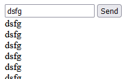

Node.JS chat application. Clone and run:
```
npm i
npm start
```



Open many tabs in browser with url: `http://localhost:8080` and try to send text from any tab, text will appear in all tabs.

Idea and code taken from javascript.info [article](https://javascript.info/websocket#chat-example).   
Very simple and short [application](server.js) without third-party components (only [ws](https://www.npmjs.com/package/ws) package)